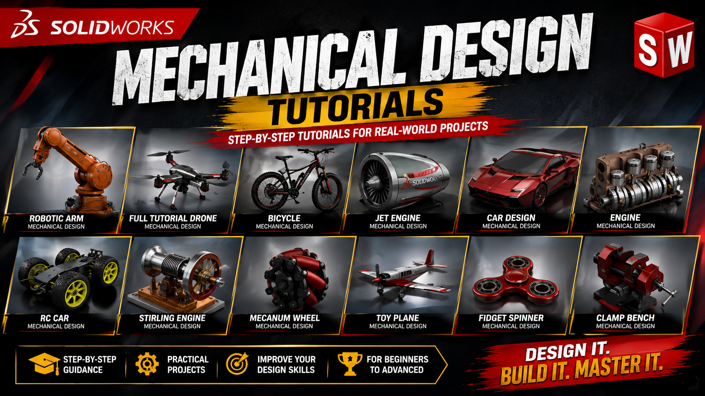
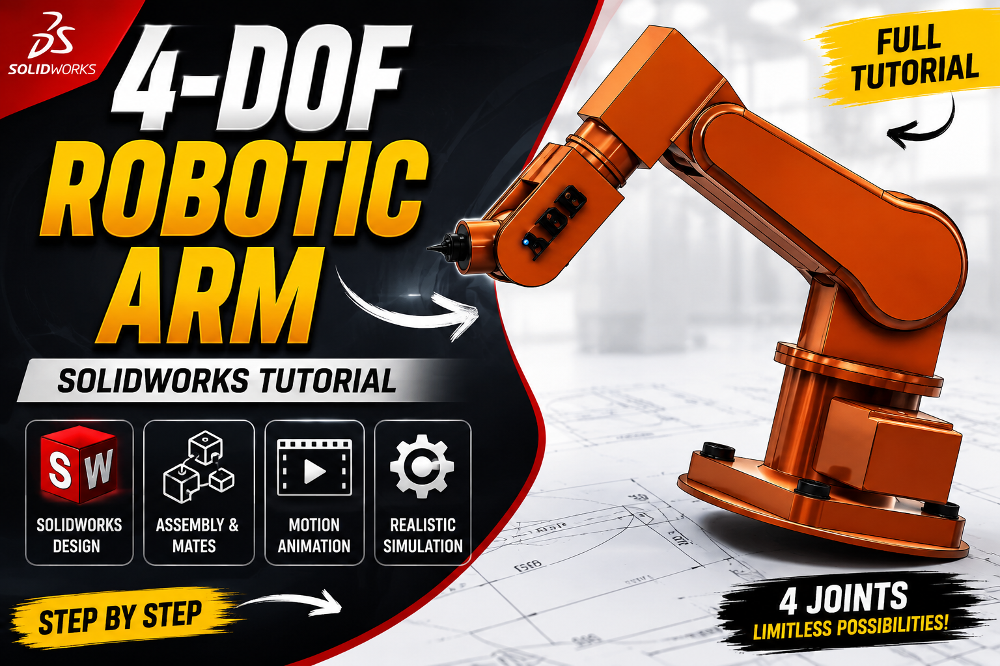
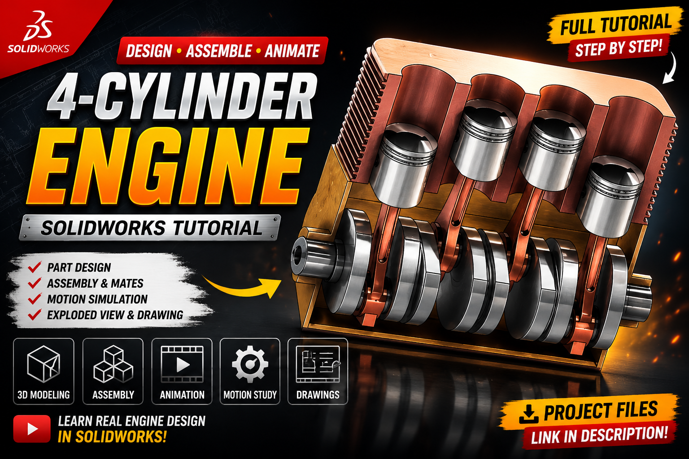
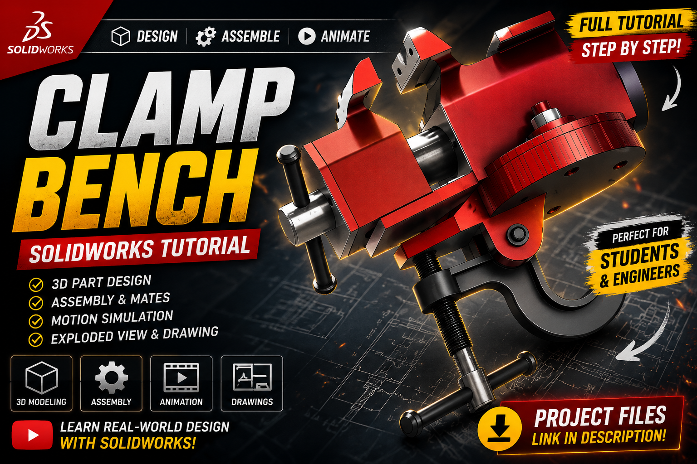
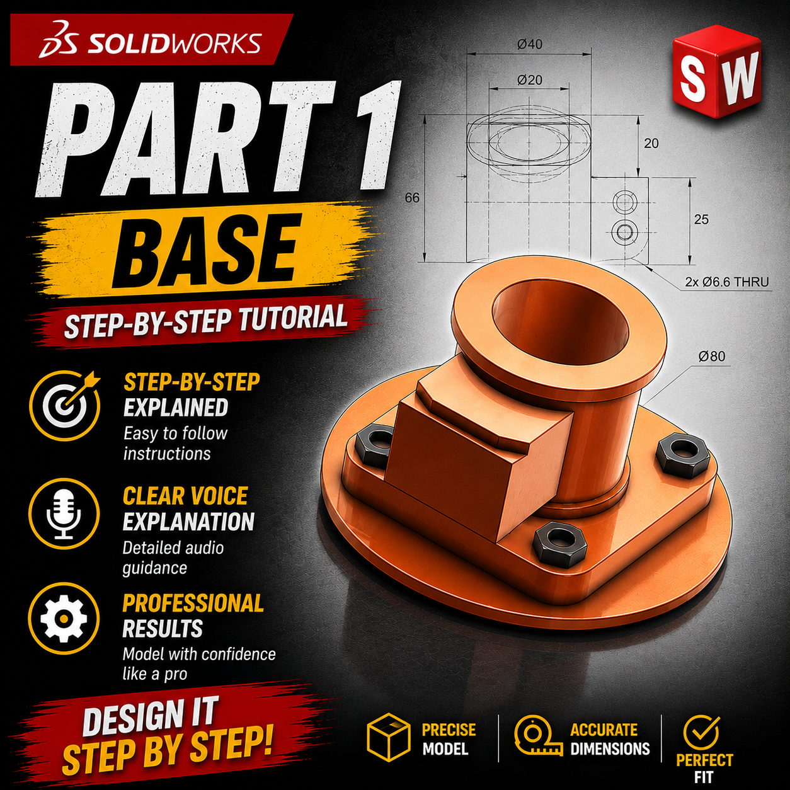
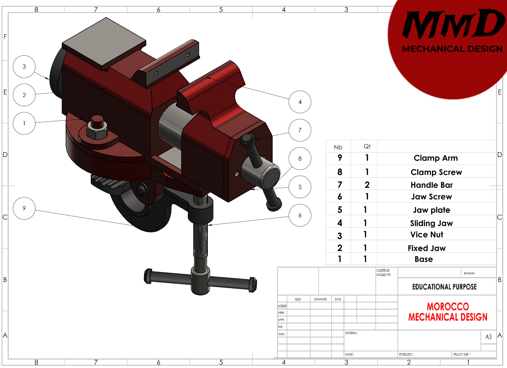
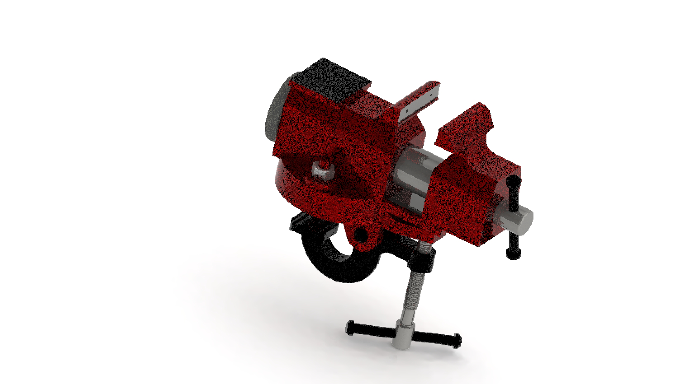
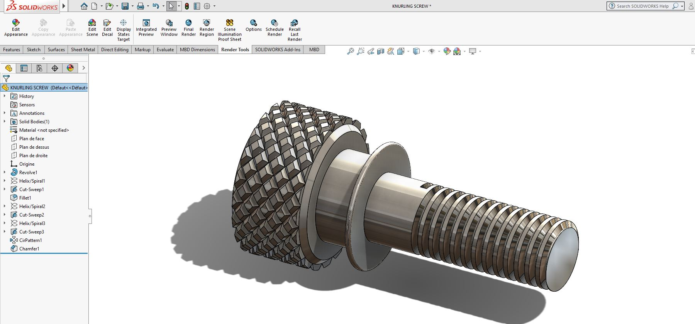
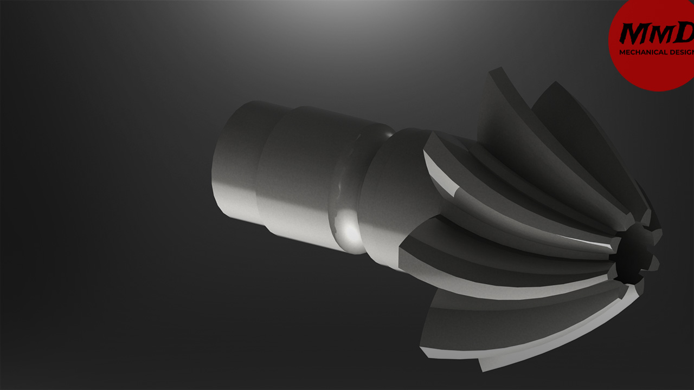

# Mechanical Design

### SolidWorks · CAD · 3D Modeling · Product Design · Assemblies · Engineering Tutorials

**Step-by-step mechanical design tutorials that take you from a blank sketch to a fully assembled, manufacturable product.**

---

## Overview

**Mechanical Design** is a YouTube channel dedicated to teaching real **mechanical engineering
design** through complete, project-based **SolidWorks** tutorials. Every video is recorded as a
full design session — sketching, part modeling, assemblies, mates, mechanisms, technical drawings
and rendering — so you learn the *workflow* a practicing design engineer actually uses, not just
isolated commands.

The channel is built around one idea: **you learn CAD by designing real products.** Instead of
abstract exercises, each series builds a genuine mechanical assembly — a robotic arm, an engine,
a bench clamp, a gearbox — with correct dimensions, proper constraints and manufacturable detail.

> **Watch here** — [youtube.com/@Mechanical.Design](https://www.youtube.com/@Mechanical.Design)
> **Get the CAD files** — [payhip.com/2Design](https://payhip.com/2Design)

---

## What You Will Learn

| Area | Skills covered |
|---|---|
| **Sketching & Fundamentals** | Fully-defined sketches, relations, design intent, reference geometry |
| **Part Modeling** | Extrude, revolve, loft, sweep, sheet metal, ribs, drafts, fillet strategy |
| **Assemblies** | Bottom-up & top-down design, mates, sub-assemblies, interference checks |
| **Mechanisms & Motion** | Linkages, cams, gears, clamps, motion study and animation |
| **Robotics & Automation** | Robotic arms, grippers, joints, actuators, kinematic layout |
| **Technical Drawings** | GD&T basics, sections, BOM, tolerances, drawing sheets for manufacturing |
| **Visualization** | Appearances, lighting, exploded views, photoreal renders and animations |
| **Product Development** | Concept, CAD, validation, documentation, manufacturing handoff |

### Why follow the channel

- **Complete projects, start to finish** — no skipped steps, no cut corners.
- **Clear voice explanation** of *why* each feature is used, not only *how*.
- **Accurate dimensions** and real engineering practice on every model.
- **Beginner-friendly pacing**, with advanced techniques layered in.
- **Ready-to-use CAD files** available so you can compare with your own model.

---

## Top Tutorials

| # | Project | What you build | Focus |
|---|---|---|---|
| 01 | **4-DOF Robotic Arm — Complete Design Project** | Multi-axis arm with gripper | Assemblies · kinematics · robotics |
| 02 | **4-Cylinder Engine Assembly** | Block, pistons, crankshaft, valvetrain | Complex assemblies · motion study |
| 03 | **Clamp Bench / Bench Vise** | Working clamp with sliding jaw | Mechanisms · mates · tooling design |
| 04 | **Gear & Linkage Mechanisms** | Gear trains and driven linkages | Motion · gearing · animation |
| 05 | **Base / Housing Parts (Part 1 series)** | Cast-style base with bosses & bolt holes | Part modeling · design intent |
| 06 | **Machine Elements — Knurled Screw** | Helical knurling, threads, chamfers | Advanced part features |
| 07 | **Technical Drawings & BOM** | Manufacturing drawing package | Documentation · tolerances |
| 08 | **Rendering & Exploded Animations** | Product presentation assets | Visualization · storytelling |

**Browse the full playlist library on the channel:**
[youtube.com/@Mechanical.Design](https://www.youtube.com/@Mechanical.Design)

---

## Gallery

---

## Community Products — Ready-to-Use CAD Files

Save hours of modeling time. The store offers **ready-made 3D models, CAD parts and complete
assemblies** you can open, study, modify and reuse in your own projects and portfolio.

| What's inside | Details |
|---|---|
| **3D models & parts** | Machine elements, housings, brackets, fasteners |
| **Complete assemblies** | Robotic arms, mechanisms, engines, fixtures |
| **Technical drawings** | Dimensioned sheets and BOMs where applicable |
| **Formats** | Native SolidWorks plus neutral formats (STEP / IGES / STL) for any CAD tool |
| **Use cases** | Learning, practice, portfolios, 3D printing, engineering projects |

**[payhip.com/2Design](https://payhip.com/2Design)**

---

## Get Started in 3 Steps

1. **Subscribe** — [youtube.com/@Mechanical.Design](https://www.youtube.com/@Mechanical.Design?sub_confirmation=1)
2. **Pick a project** from the Top Tutorials table and model along in SolidWorks.
3. **Download the CAD files** from [payhip.com/2Design](https://payhip.com/2Design) and compare your
   result with the reference model.

---

## Links

| Platform | Link |
|---|---|
| YouTube | https://www.youtube.com/@Mechanical.Design |
| CAD Store | https://payhip.com/2Design |

---

## Topics

`mechanical-design` · `solidworks` · `cad` · `3d-modeling` · `product-design` ·
`mechanical-engineering` · `assemblies` · `robotics` · `tutorials` · `engineering` ·
`design-engineering` · `cad-tutorials` · `solidworks-tutorial` · `motion-study` ·
`technical-drawing` · `gdt` · `3d-printing` · `stem-education`

<b>Keywords for search</b>

Mechanical Design tutorials, SolidWorks tutorial for beginners, SolidWorks advanced assembly,
CAD design course, 3D modeling tutorial, product design workflow, mechanical engineering design,
robotic arm SolidWorks, engine assembly CAD, bench clamp mechanism, gear mechanism design,
sheet metal SolidWorks, technical drawing and GD&T, exploded view animation, photoreal rendering,
downloadable CAD files, STEP STL models, engineering portfolio projects.

---

**Design it. Build it. Master it.**

Made for engineers, students and makers who want to design real products.

